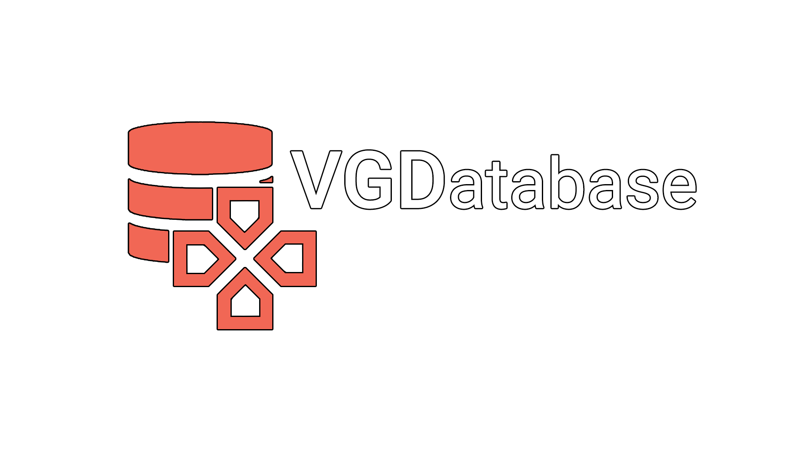

**VGDatabase (VGDB)** is a platform designed and built for gamers by gamers.

The site is based on a videogames database, where you can view many information about any games such as genre, developer, date of release, score and the reviews written by other users, with an additional external link for the purchase. The platform also provides a search functions by title or by genre, and a search for registered users. In addition, the site is updated periodically, always showing in the homepage the most popular games at the moment. Each user has his own library of games, a friends list and the possibility to group games and friends in Favorites lists. Enjoy!

**The site is now live, [check it out](https://vgdatabase.herokuapp.com/)!**

## Authors

*   **Giovanni Roma** - roma.1808340@studenti.uniroma1.it - [GitHub](https://github.com/JoGist) - [LinkedIn](https://www.linkedin.com/in/giovanni-roma-a95a32127/)
*   **Marco Musciaglia** - musciaglia.1816864@studenti.uniroma1.it - [GitHub](https://github.com/loldlink)
*   **Matteo Sabatini** - sabatini.1794627@studenti.uniroma1.it - [GitHub](https://github.com/ZioSaba)


## Dependencies
In order to build and run the Rails server in your machine, you must have installed:
*   _Ruby 2.4_
*   _Rails 6_
*   _Bundler 2_
*   _Postgres 9 or above_
*   _JavaScript (any version)_


## Rails app setup

In order to successfully run the project, you have to obtain a valid API key on these services:
* IGDB - https://www.igdb.com/api
* Google - https://support.google.com/cloud/answer/6158849?hl=en
* Steam - https://steamcommunity.com/dev/apikey


To build and run the Rails app, go into the root folder of the repo and run the following commands:

* Build and install all required Gems included in Gemfile:
  ```sh
  Bundle install
  ```
  
* Initialize Figaro gem, to store securely store your OAuth credentials: 
  ```sh
  figaro install
  ```
  
* To show your secret key, copy it as you will use it later:
  ```sh
  rake secret
  ```

* To enter your OAuth credentials and API keys, open the file /config/application.yml created with 'Figaro install', and append at the end of file as following:
  ```sh
  STEAM_WEB_API_KEY: '[your-steam-api-key-here]'
  SECRET_TOKEN: '[your-rake-secret-key-here]'

  GOOGLE_CLIENT_ID: '[your-google-client-id-here].apps.googleusercontent.com'
  GOOGLE_CLIENT_SECRET: '[your-google-api-key-here]'
  ```

* Insert your IGDB API key in the credentials file with:
  ```sh
  EDITOR='[any-IDE-here] --wait' rails credentials:edit
  ```
  And append at the end of the file that opens up the following code:
  ```sh
  maps:
    igdb: '[your-igdb-api-key-here]'
  ```

* Edit in /config/database.yml the username and password with the one you have set in your local machine.

* Ensure that the Postgres service is started:
  ```sh
  sudo service postgresql start
  ```
  
* Initialize the db:
  ```sh
  rake db:reset
  ```
 
* Execute database migrations:
  ```sh
  rake db:migrate
  ```
  
## Rails app usage

After the first setup, execute these commmands to start the server and deploy the application:

* Start the rails server:
  ```sh
  rails server
  ```
  
* Then simply go on this page with your browser of choice and you're done!
  ```sh
  localhost:3000/login
  ```

## Cucumber & RSpec testing

This project also includes several test cases to test the functioning of the main functions of the site. A detailed description of each test and what they do is avaiable [here](Relazione.pdf). 
To execute them, you need to launch respectively:

* Cucumber test:
  ```sh
  cucumber ./features/*.feature
  ```
  
* RSpec test:
  ```sh
  bundle exec rspec ./spec/*_spec.rb
  ```

### Other useful command
* Run the integrated Rails console
  ```sh
  rails console
  ```

* View all the routes created in the project
  ```sh
  rails routes
  ```

* Drop and recreate the schema and the tables
  ```sh
  rake db:reset
  ```

* Execute database table migrations that are pending
  ```sh
  rake db:migrate
  ```
 
